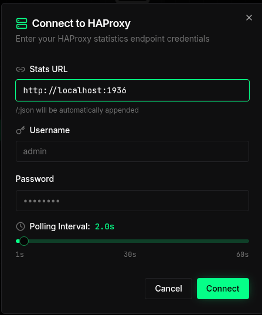

# HAProxy Monitoring Dashboard

EasyHAProxy ships a real-time monitoring dashboard that gives you a live view of your HAProxy
instance — frontends, backends, servers, traffic volume, request rates, and more — all from a
single page, with no extra software required.


## Enabling the dashboard

Two environment variables are required:

| Variable                    | Purpose                                                                                                                                       |
|-----------------------------|-----------------------------------------------------------------------------------------------------------------------------------------------|
| `HAPROXY_PASSWORD`          | Enables the stats endpoint and the dashboard.                                                                                                 |
| `HAPROXY_STATS_CORS_ORIGIN` | Allows the dashboard page to call the stats API. **Required** — without it the browser blocks the requests and the dashboard shows no data.   |

The dashboard page is served from port `HAPROXY_STATS_PORT + 10000`, but it fetches data from
the stats API at `HAPROXY_STATS_PORT`. Because those are different ports, the browser treats
them as different origins and enforces CORS. Set `HAPROXY_STATS_CORS_ORIGIN` to the exact origin
you will use to open the dashboard.

```bash
docker run \
  -e HAPROXY_PASSWORD=secret \
  -e HAPROXY_STATS_CORS_ORIGIN=http://localhost:11936 \
  ... byjg/easy-haproxy
```

If you access the dashboard from a non-localhost address (e.g. a server IP or hostname), match
that origin instead:

```bash
-e HAPROXY_STATS_CORS_ORIGIN=http://192.168.1.10:11936
```

## Accessing the dashboard

The dashboard is served on a dedicated port: **`HAPROXY_STATS_PORT + 10000`**.

| `HAPROXY_STATS_PORT` (default `1936`) | Dashboard URL               |
|---------------------------------------|-----------------------------|
| `1936`                                | `http://<host>:11936/`      |
| `8080`                                | `http://<host>:18080/`      |

Open `http://<host>:11936/` (or `http://<host>:11936/dashboard.html`) in your browser.
Requests to `/` and `/index.html` are automatically redirected to the dashboard page.
Any other path returns a `404`.

### Login

The first time you open the dashboard (or after disconnecting), a **Connect to HAProxy** dialog
appears:



Fill in the three fields:

| Field | What to enter | Example |
|---|---|---|
| **Stats URL** | The stats API base URL — `http://<host>:<HAPROXY_STATS_PORT>`. The dashboard appends `/;json` automatically. | `http://localhost:1936` |
| **Username** | The value of `HAPROXY_USERNAME`. | `admin` |
| **Password** | The value of `HAPROXY_PASSWORD`. | `secret` |

You can also adjust the **Polling Interval** (1 s – 60 s) to control how often the dashboard
refreshes live data. Click **Connect** to open the main view.

:::info Why enter the Stats URL manually?
The dashboard HTML is static — it has no knowledge of which host or port HAProxy is running on.
Entering the URL at login time makes the dashboard work in any environment without any
server-side configuration.
:::

:::info Why a separate port?
The stats API (`HAPROXY_STATS_PORT`) speaks the native HAProxy stats protocol.
The dashboard port (`+10000`) is a plain HTTP frontend that proxies to an embedded Python
HTTP server running inside EasyHAProxy. This split keeps the two concerns cleanly separated
and avoids HAProxy's 16 KB inline-file limit.
:::

## What you can see

### Summary cards

At the top of the page, eight cards give an instant health snapshot:

| Card          | Description                                                                  |
|---------------|------------------------------------------------------------------------------|
| **FRONTENDS** | Number of open frontends vs. total, with an "All UP" indicator               |
| **BACKENDS**  | Number of backends that are UP vs. total; highlights DOWN backends in orange |
| **SERVERS**   | Server health across all backends — UP, DOWN, and "no check" counts          |
| **BYTES IN**  | Cumulative bytes received since last HAProxy start                           |
| **BYTES OUT** | Cumulative bytes sent since last HAProxy start                               |
| **SESSIONS**  | Current active sessions                                                      |
| **REQUESTS**  | Total HTTP requests processed                                                |
| **REQ/S**     | Current request rate                                                         |

### Charts

Two real-time charts update every few seconds:

- **Traffic Volume** — bytes in and bytes out plotted over time
- **Request Rate & Sessions** — req/s and concurrent sessions plotted over time

### Frontends & Backends table

A tabbed table lets you drill into every frontend and backend:

- **All** tab — frontends first, then backends and their servers
- **Frontends** tab — name, status (OPEN/CLOSED), sessions, bytes in/out, request rate
- **Backends & Servers** tab — backend health (UP/DOWN), session count, traffic, per-server
  detail with Expand / Flat toggle

You can filter by name using the search box above each section.

## What makes this unique

Most HAProxy installations expose only the raw stats page (tables of numbers) or require
a separate Grafana + Prometheus stack for visualization.
EasyHAProxy bundles a polished, self-contained dashboard that:

- requires **zero extra containers** — it runs inside the EasyHAProxy process itself
- uses **HAProxy's own stats socket** — no metrics scraping pipeline
- works **out of the box** — enable with a single environment variable
- is accessible over a plain HTTP connection — no TLS setup needed for internal monitoring

## Environment variables

| Variable | Description | Default |
|---|---|---|
| `HAPROXY_PASSWORD` | Enables stats **and** the dashboard. Required. | *empty* |
| `HAPROXY_USERNAME` | Username for the stats endpoint. | `admin` |
| `HAPROXY_STATS_PORT` | Stats API port. Dashboard is served on this port **+ 10000**. | `1936` |
| `HAPROXY_STATS_CORS_ORIGIN` | **Required for the dashboard.** Set to the exact origin you use to open the dashboard (e.g. `http://localhost:11936`). Without this the browser blocks stats API calls and the dashboard shows no data. | *empty* |

See the full [Environment Variables reference](../reference/environment-variables.md) for details.

----
[Open source ByJG](http://opensource.byjg.com)
