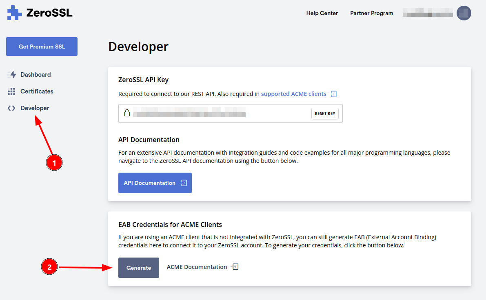
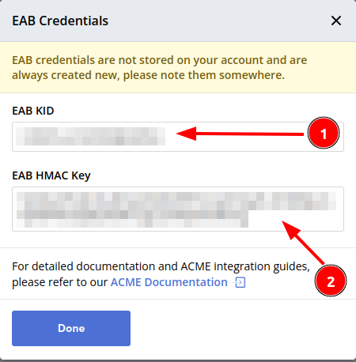

# ZeroSSL

EasyHAProxy can issue a ZeroSSL certificate. Follow the steps below:

## Getting the Keys from ZeroSSL

- Login to [ZeroSSL](https://zerossl.com?fpr=byjg)
- If you don't have an account you can use our referral link: [https://zerossl.com?fpr=byjg](https://zerossl.com?fpr=byjg)
- If you created recently and would like to support us open an issue, and I'll try to add you as our referred.
- In the ZeroSSL dashboard click in 'Developer' and the Generate EAB Keys



- Once you generate the keys, please **take note**. We will need this later, and it isn't saved anywhere.



```text
Important: if you to this process again the old values will be lost and you need to setup EasyHAProxy again.
```

## Setting up EasyHAProxy

Run the EasyHAProxy container with the following parameters:

```bash
docker run \
    ... \
    -e EASYHAPROXY_CERTBOT_EMAIL="your zerossl email" \
    -e EASYHAPROXY_CERTBOT_EAB_KID="the eab_kid from the previous step" \
    -e EASYHAPROXY_CERTBOT_EAB_HMAC_KEY="the eab_hmac_key from the previous step" \
    -e EASYHAPROXY_CERTBOT_SERVER="https://acme.zerossl.com/v2/DV90" \
    -p 80:80 \
    -p 443:443 \
    -v /path/to/guest/certbot/certs:/certs/certbot \
    ... \
    byjg/easy-haproxy
```

Notes:

- If you don't setup all `EASYHAPROXY_CERTBOT_*` environment variables with the proper values, EasyHAProxy will fail silently and **will not request** a certificate.
- The ports 80 and 443 needs to accessible through the internet as [Let's Encrypt requirement](https://letsencrypt.org/docs/allow-port-80/)

**It is required you to persist the container folder `/certs/certbot` outside the container.**

You cannot delete or change it contents. 
If you do not persist, or change/delete the contents, Let's encrypt will not work properly. 


## Setting up your container to use ZeroSSL

```bash
docker run \
    ... \
    --label easyhaproxy.express.port=80 \
    --label easyhaproxy.express.localport=3000 \
    --label easyhaproxy.express.host=example.org \
    --label easyhaproxy.express.certbot=true \
    ... \
    some/myimage
```

Requirements:

- Your container **must** listen to port 80. Letsencrypt will not issue the certificate if `easyhaproxy.<definition>.port` is in another port, and EasyHAProxy will fail silently.
- You cannot set port 443 for the container with the Letsencrypt because EasyHAProxy will create this port automatically once the certificate is issued.

----
[Open source ByJG](http://opensource.byjg.com)
